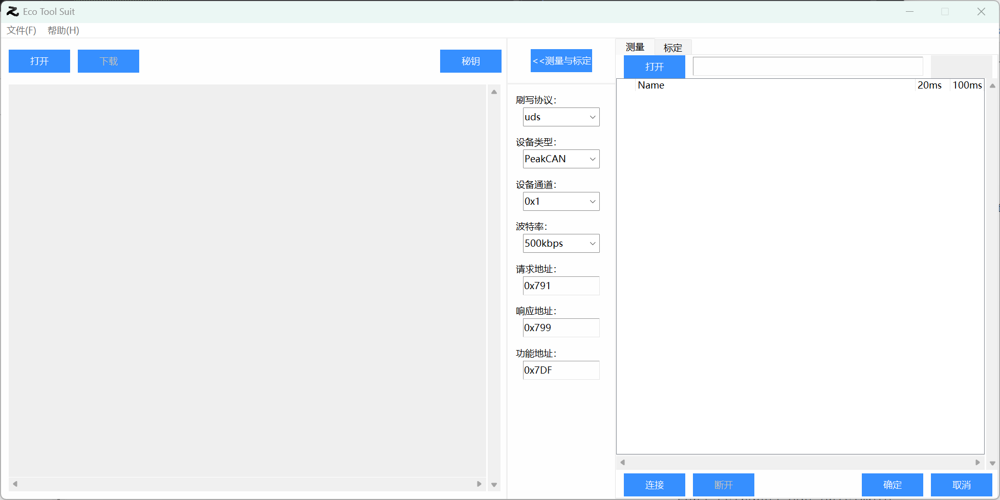

> # 产品信息
> **Eco Tool Suit**

> # 本产品包含以下内容
> * **Eco Download**
> * **Eco Measure&Calibrate**

> # 功能说明
> ## Eco Downloader
> 1. 使用ccp协议下载程序
> 2. 使用uds协议下载程序
> ## Eco Measure&Calibrate
> 1. 使用ccp协议进行测量
> 2. 使用ccp协议进行标定,支持VALUE\CURVE\MAP\VAL_BLK类型

> # 使用说明
> ## 操作系统
> **Windows10及以上版本(x86/x64)**
> ## Python版本(32位)
> * **Python3.11.9** [Python解释器下载](https://www.python.org/ftp/python/3.11.9/python-3.11.9.exe)
> ## 外部依赖（建议使用项目提供的文件）
> 1. 安装PCAN驱动程序 [PEAK-System_Driver下载](https://peak-system.com.cn/wp-content/uploads/2025/07/PEAK-System_Driver-Setup.zip)
> 2. 将.dll文件按照如下路径放置
>    * For x64 Windows systems [PCAN-Basic API下载](https://peak-system.com.cn/wp-content/uploads/2025/07/PCAN-Basic.zip)
>      - docs\LIB\PCAN-Basic\x86\PCANBasic.dll --> C:\Windows\SysWOW64
>      - docs\LIB\PCAN-Basic\x64\PCANBasic.dll --> C:\Windows\System32
>    * PCCP.dll --> Eco Tool Suit.exe同级路径 [PCAN-CCP API下载](https://peak-system.com.cn/wp-content/uploads/2025/07/PCAN-CCP.zip)
>    * PCAN-ISO-TP.dll --> Eco Tool Suit.exe同级路径 [PCAN-ISO-TP API下载](https://peak-system.com.cn/wp-content/uploads/2025/07/PCAN-ISO-TP.zip)
>    * PCAN-UDS.dll --> Eco Tool Suit.exe同级路径 [PCAN-UDS API下载](https://peak-system.com.cn/wp-content/uploads/2025/07/PCAN-UDS.zip)
> ## 打包方式
> **PyInstaller**
> * 安装pyinstaller模块
> 
>   `pip install pyinstaller`
> * 打包成exe
> 
>   `pyinstaller main.py -F -w -i .\icons\Z.ico -n "Eco Tool Suit"`
> 
> ## 运行exe
> * 以管理员身份运行Eco Tool Suit.exe
> 
> ### 使用Eco Download
> 1. 选择刷写密钥
>   * CCP -> PG_Default.dll
>   * UDS -> UdsSeedKeyDll.dll
> 2. 打开程序文件(.mot)
> 3. 点击下载按钮
>
> ### 使用Eco Measure&Calibrate
> 1. 点击打开按钮，打开程序文件(.mot)和测量标定文件(.a2l)，连接ECU
> 2. 若要测量，在测量对象列表中选中测量对象添加至测量窗口，启动测量
> 3. 若要标定，在标定对象列表中选中标定对象添加至标定窗口，双击修改值到RAM，可手动保存标定数据到下载文件或刷写到ROM
> 4. 退出时自动保存测量数据、标定数据，下次打开软件时自动加载

> # 其它
> * 本产品仅用于学习交流，请勿用于商业用途
